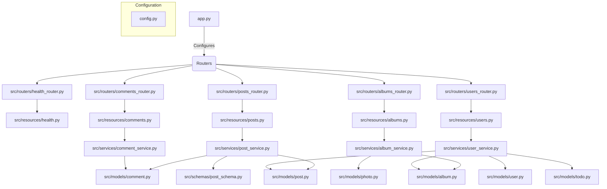

# Prototype Falcon

A modular and scalable REST API built with Falcon (ASGI) that replicates the behavior of JSONPlaceholder. This project demonstrates clean architecture principles with separation of concerns and extensibility for future enhancements.



## ✨ Features

- In-memory data storage with auto-incrementing IDs
- JSON responses for all endpoints
- Basic validation for required fields
- CORS support
- Error handling and appropriate HTTP status codes

## ⚙️ Installation & Running

Clone the repository

```bash
git clone https://github.com/tyronejosee/prototype_falcon.git
```

> Note: Python and [UV](https://docs.astral.sh/uv/) is required for running the application.

Create a virtual environment and install dependencies

```bash
uv venv
```

Activate the virtual environment

```bash
# Windows
.venv\Scripts\activate.ps1

# Linux/Mac
source .venv/bin/activate
```

```bash
uv pip install -r requirements.txt
```

Run the application using uvicorn

```bash
uvicorn app:application --reload
```

The API will be available at `http://localhost:8000`

## 🌱 Endpoints

### Health Check

- `GET /` - API health check

### Posts

- `GET /posts` - Get all posts
- `GET /posts/{id}` - Get specific post
- `POST /posts` - Create new post
- `PUT /posts/{id}` - Update post
- `PATCH /posts/{id}` - Partial update post
- `DELETE /posts/{id}` - Delete post
- `GET /posts?userId={id}` - Filter posts by user
- `GET /posts/{id}/comments` - Get post comments

### Comments

- `GET /comments` - Get all comments

### Albums & Photos

- `GET /albums/{id}/photos` - Get album photos

### Users

- `GET /users/{id}/albums` - Get user albums
- `GET /users/{id}/todos` - Get user todos
- `GET /users/{id}/posts` - Get user posts

Enjoy! 🎉
